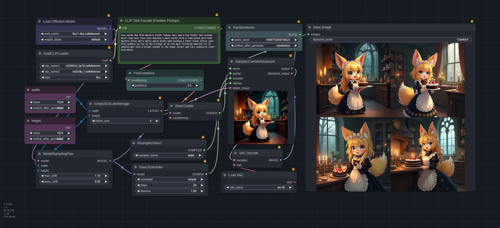
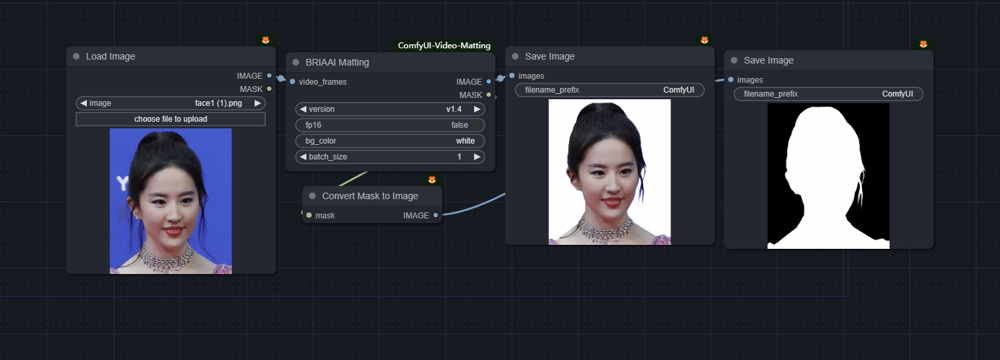
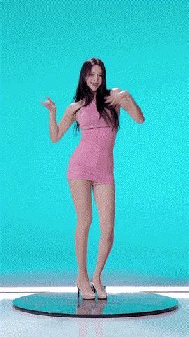
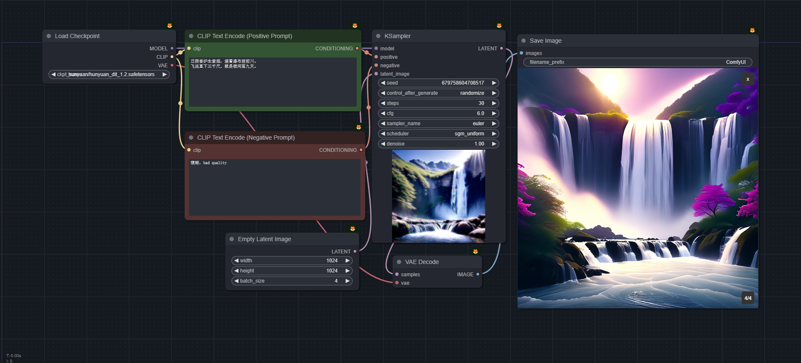
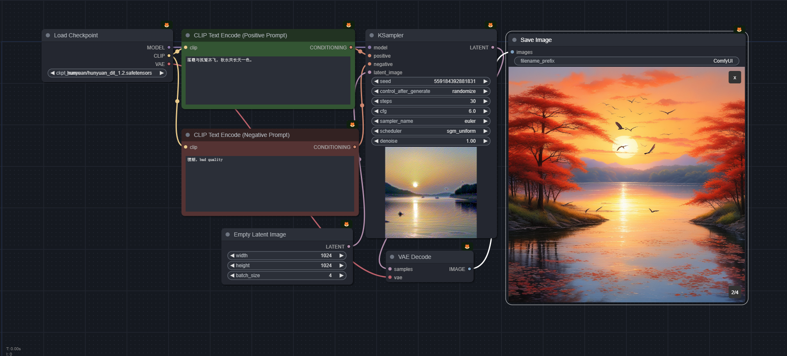
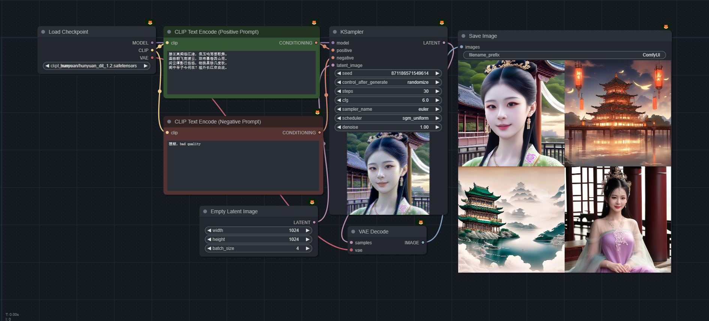
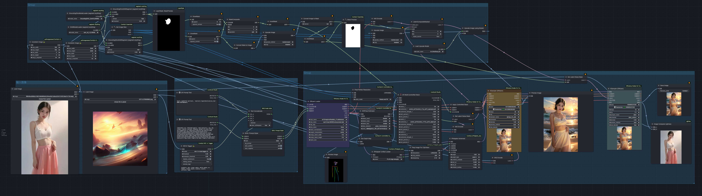
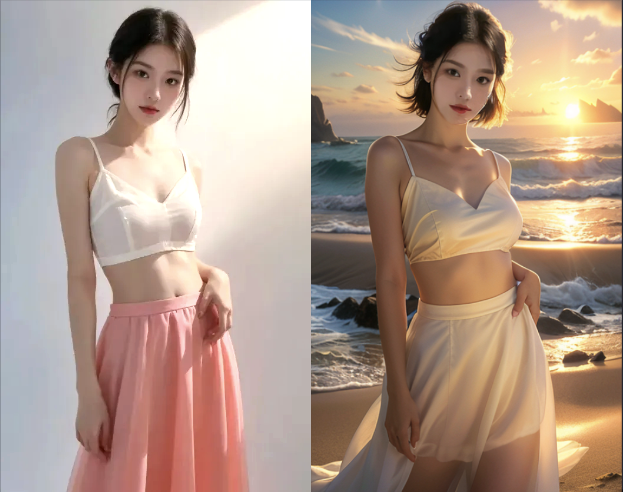
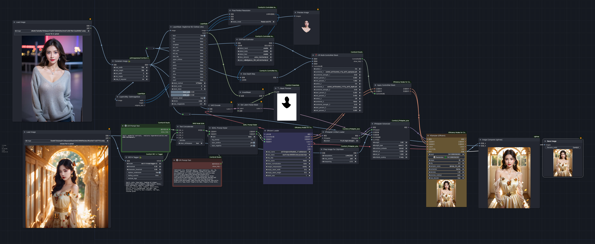

# comfyui_workflows

- 基础工作流
- 工具
- 高级工作流
- comfyui 插件说明

tips: can be directly dragged into comfyui

### 基础工作流

- sd15 basic, 官方示例
  
- sdxl basic 1
  
- sdxl basic 2
  
- svd basic
  
  
- sd3 medium
  
- flux1-dev, 文本控制力强，模型强大
  

### 工具
- reactor, 换脸简单示例
   
- dwpose keypoints detect
   
- depth map
- yolo 
  - yolo face detect
    
  - yolo face seg [model ref from](https://huggingface.co/jags/yolov8_model_segmentation-set/tree/main)，选择不同的模型得到不同区域，适用于人脸，人体等
    
  - yolo worlds
  - yolo hands detect
- super resolution
  - basic sr model with img
    
- face landmarks seg
- clothes seg
- background remove
  - BRIA 1.4（could deal with video）
  
  
- inpaint model, inpaint mouth
  

### 高级工作流
- 接入sd3 medium 的中文版肖像大师，ref from [zho-zho-zho](https://github.com/ZHO-ZHO-ZHO/ComfyUI-Workflows-ZHO)
  
- style align 风格一致性生成 [style align](https://github.com/brianfitzgerald/style_aligned_comfy)  [教学](https://www.youtube.com/watch?v=itBiBOYWHF8)
  - 在一个batch内, 可以生成朝向一致且风格一致的结果
  
- 人脸修复 适用 facedetailer 模块进行重采样，注意此处会修复过大，失真可能严重，谨慎使用
  - 模型生成的人脸
    
  - 输入人脸
    
- ipadapter 多元素组合，全图作用
  
- ipadapter faceid, sd15 模型, 注意 prompt 不能过于复杂
  
- ipadapter 使用 mask 对图片进行换衣，需要使用 inpaint 模型
  
- 自动视频换装，使用 ipadapter + animatediff 进行视频换装
  - 此处计算比较耗时，酌情运行，可以降低图像分辨率，主要思想是利用 ipadapter 的 attn mask 功能对视频进行局部重绘
  - 需要注意不同 base 模型对视频效果影响挺大，这里使用的是 [麦橘v7](https://civitai.com/models/43331/majicmix-realistic)
  
  
  
- InstantID 和 ipadapter 结合，生成特定风格的任务，感谢大佬 [cubiq](https://github.com/cubiq/ComfyUI_InstantID/blob/main/examples/InstantID_IPAdapter.json)
  
- InstantID 和 controlnet depth 结合，生成指定动作的任务形象
  
- sdxl + ipadapter, 强风格转换
  
- easyanimate，图像到视频或者 文本到视频, ref from [easyanimate](https://github.com/aigc-apps/EasyAnimate/blob/main/comfyui/README.md)
  
  
- hunyuan Dit 中文理解能力强,古诗词和概念组合
  
  
  
  
- ai 摄影工作流，
  - 基于 sd15 模型，利用分割模型得到人物面部，适用局部重绘进行重新生成，
  - 利用 openpose 和 depthmap 进行人物姿态控制
  - 基于 sd15 的 base 模型，可以根据参考图片反推提示词
  
  
  
  - 利用 segformer 进行人物主体分割，比使用 dino 和 sam 更轻量
  

### 常见 prompt

- positive
  -  high quality, and the view is very clear. High quality, masterpiece, best quality, highres, ultra-detailed, fantastic.
  -  
- negative
  -  strange motion trajectory, a poor composition and deformed video, low resolution, duplicate and ugly, strange body structure, long and strange neck, bad teeth, bad eyes, bad limbs, bad hands, rotating camera, blurry camera, shaking camera. Deformation, low-resolution, blurry, ugly, distortion.
  -  

### comfyui 插件说明

- https://github.com/ltdrdata/ComfyUI-Impact-Pack
- https://github.com/WASasquatch/was-node-suite-comfyui
- https://github.com/rgthree/rgthree-comfy
- https://github.com/pythongosssss/ComfyUI-Custom-Scripts
- https://github.com/Suzie1/ComfyUI_Comfyroll_CustomNodes
- 